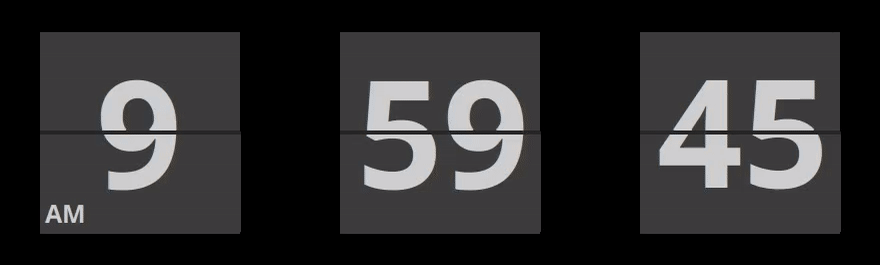

# Flip Leaf Clock
1970's styled flap clock screen saver for linux with x11.

Mimics the mechanical flip display on clocks made by a number manufacturers.


c++ code depends on lib Xft, uses Xshm for faster animation.


#### Build
make


#### Install
copy the built 'flip_leaf_clock' executable to where your screen savers are installed (root priveleges req)\
e.g: Ubuntu folder: /usr/lib/xscreensaver/

copy 'flip_leaf_clock.xml' file to your screen savers config folder:\
e.g: /usr/share/xscreensaver/config/

Add a single line entry like below to '/home/YOURUSER/.xscreensaver' settings file,\
(make sure 'xscreensaver-demo' is not running as it rewrites this file):


				flip_leaf_clock -root -g 33 -b 20 -s	    \n\
				

Now run 'xscreensaver-demo' and you should find 'flip_leaf_clock' is available, select it and adjust as required.


Enjoy.


To run as stand alone app invoke as below:

```sh
./flip_leaf_clock -a -s
```
```sh
./flip_leaf_clock -h
```


#### To Do
- Add filtering to remove jaggies during flip, as is done for small window in 'xscreensaver-demo'


#### .....



